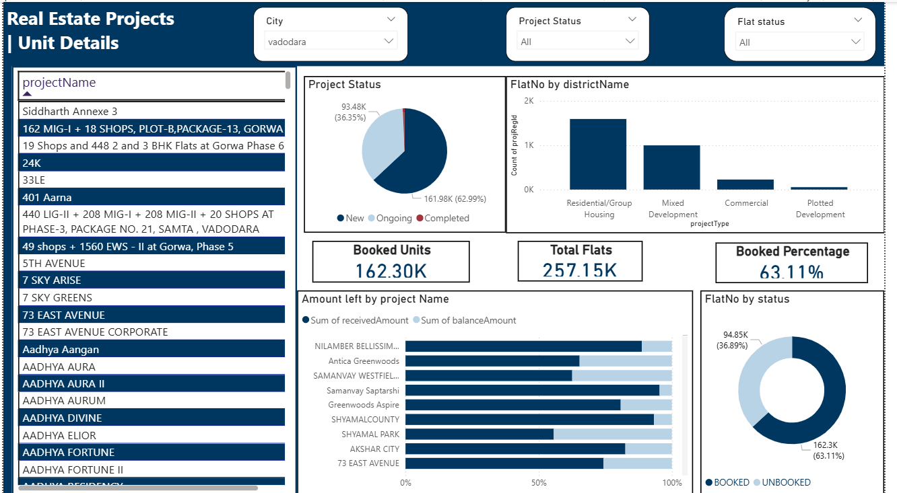
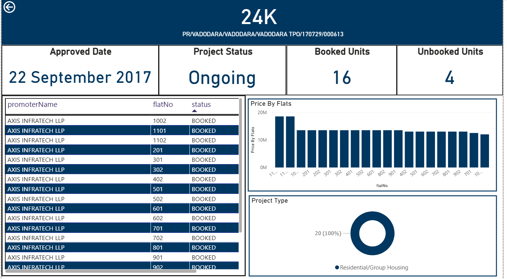

# Real Estate RERA Power BI Dashboard

Interactive Power BI dashboard built to analyze real estate projects based on RERA data.  
Provides detailed insights into project status, unit-level booking trends, and financial metrics.

## 🚀 Features
- Drill-through analysis from project level to unit-level details (flats).
- Filters by City, Project Status, and Flat Status.
- Visualizations:
    - Price by Flat
    - Booked vs Unbooked Units
    - Project Type Distribution
    - Total Flats vs Booked Units
    - Amount Received vs Balance Amount
- Key Metrics:
    - Total Booked Units
    - Total Flats
    - Booking Percentage

## 📂 Repository Structure
RealEstate-RERA-PowerBI-Dashboard/
│
├── Dashboard.pbix
├── Data/
│ └── real_estate_data.csv
├── Screenshots/
│ └── page1.png
│ └── page2.png
├── README.md

## ⚡ How to Use
1. Open `Dashboard.pbix` in Power BI Desktop (downloadable from Microsoft).
2. Load the dataset from `Data/real_estate_data.csv`.
3. Explore interactive visualizations and filters.

## 📸 Screenshot  

## 📂 Dataset and Report  
- Sample Data: `Data/real_estate_data.csv`  
- Power BI Dashboard file: [Download Dashboard.pbix]([https://drive.google.com/file/d/1AbCdEfGhIjKlMnOpQrStUvWxYz/view?usp=sharing](https://drive.google.com/file/d/14HZFU9g-flyeWdU8sPTo_4P5rEFVfkLJ/view?usp=sharing))

## 📋 Notes
- No separate report file included.
- Designed for real estate analysis using RERA (Real Estate Regulatory Authority) data.

